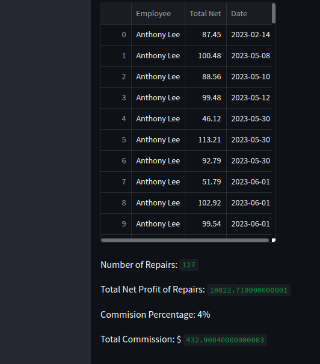
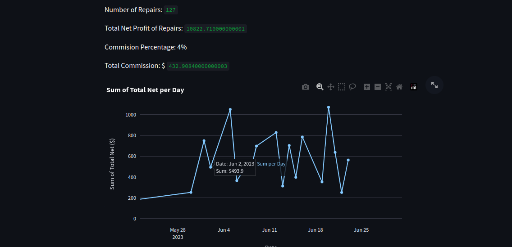

# Commission Dashboard
This is a commission dashboard application built using Streamlit. It provides commission statistics and visualizations for technicians at Phone Doctors. Please note that while the version shared on GitHub contains fake numbers, the actual version used by co-workers will contain private commission data.





This above is a picture of some of the data that i have visualized for employees 


# Installation
To run this dashboard locally, please follow these steps:

1. Clone the repository:

```bash
git clone <https://github.com/alee97422/commission_dashboard>
```


1Install the required dependencies. You can use pip to install them:

``` bash
pip install streamlit pandas plotly
```

# Usage
Ensure that you have the required SQLite database file comish2.db in the same directory as the script.

Run the following command to start the Streamlit application:
```streamlit
streamlit run app.py
```
Access the dashboard by opening the provided URL in your browser.

# Dependencies
The following dependencies are used in this project:

streamlit: Used to create the web-based dashboard.
pandas: Used for data manipulation and analysis.
plotly: Used for interactive and visually appealing visualizations.
Please make sure to install these dependencies before running the application.

#Project Structure
The project consists of the following files:

- commission_dashboard.py: The main script that creates the commission dashboard using Streamlit. It imports different computation and visualization functions specific to each employee.

- employee_1.py, employee_2.py, employee_3.py, employee_4.py, employee_5.py: Separate Python files containing computation and visualization functions for each employee. These files are imported in the main script.

- comish2.db: SQLite database file containing the commission data.
This file is not included for security and privacy purposes

- README.md: Documentation file providing information about the project.


# Employee-Specific Computation and Visualization
The dashboard provides separate sections for each employee. By clicking on their name in the sidebar, you can access their specific commission statistics and visualizations.

## Employee 1
Description: This section displays the commission statistics and visualizations for Employee 1.

## Employee 2
Description: This section displays the commission statistics and visualizations for Employee 2.

The computation and visualization for Employee 2 are defined in the employee_2.py file. The script connects to the SQLite database, fetches the necessary data, and performs various calculations and visualizations. It displays a DataFrame containing the commission data, the number of repairs, total net profit of repairs, commission percentage, and total commission. Additionally, it creates a line chart showing the sum of the total net per day.

## Employee 3
Description: This section displays the commission statistics and visualizations for Employee 3.

The computation and visualization for Employee 3 are defined in the employee_3.py file. The script connects to the SQLite database, fetches the necessary data, and performs various calculations and visualizations. It displays a DataFrame containing the commission data, the number of repairs, total net profit of repairs, commission percentage, and total commission. Additionally, it creates a line chart showing the sum of the total net per day.

## Employee 4
Description: This section displays the commission statistics and visualizations for Employee 4.

The computation and visualization for Employee 4 are defined in the employee_4.py file. The script connects to the SQLite database, fetches the necessary data, and performs various calculations and visualizations. It displays a DataFrame containing the commission data, the number of repairs, total net profit of repairs, commission percentage, and total commission. Additionally, it creates a line chart showing the sum of the total net per day.

## Employee 5
Description: This section displays the commission statistics and visualizations for Employee 5.

The computation and visualization for Employee 5 are defined in the employee_5.py file. The script connects to the SQLite database, fetches the necessary data, and performs various calculations and visualizations. It displays a DataFrame containing the commission data, the number of repairs, total net profit of repairs, commission percentage, and total commission. Additionally, it creates a line chart showing the sum of the total net per day.

